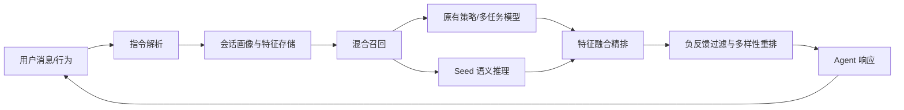

# 系统架构与生产化设计

## 在线链路



当前原型中，`HybridRetriever`、`FusionRanker`、`SeedModel`、`ProfileStore` 都有明确边界，可以分别替换为线上召回服务、精排服务、Seed RPC 和 Redis/特征平台。

## 联合 Token 训练

训练序列交错包含自然语言和推荐专用 Token，例如：

```text
输入: 用户兴趣... <CLICK_i1> 候选: <ITEM_i1> 标题=... 当前请求=想看国风历史
输出: <ITEM_i5> <ITEM_i1> 推荐结果应匹配当前需求，同时规避负反馈...
```

训练时给 tokenizer 扩充 `<ITEM_x>`、`<CLICK_x>`、`<DISLIKE_x>` 等专用 Token；Item embedding 可以由内容编码器初始化，再与 Seed 的词向量空间进行投影对齐。目标函数为：

`L = 0.55 * L_rec_token_ce + 0.35 * L_text_ce + 0.10 * L_alignment`

线上不能直接把海量 Item 全加入词表。生产方案应使用分层码本、RQ-VAE semantic ID 或固定长度 Item code，并做好版本映射、下线内容屏蔽与 OOV 回退。

## 稳定性与观测

- Seed RPC 设置分级超时；超时后回退原精排，避免模型拖垮主链路。
- 用户画像更新使用事件流异步落库，显式对话偏好保存在会话级缓存并同步应用。
- 记录 request_id、各路召回量、模型版本、特征快照、reason code、过滤原因和分段延迟。
- 通过小流量灰度、互斥实验层、指标护栏和自动回滚上线，避免实验串组。
- 不向客户端输出原始自由文本 CoT，只输出结构化证据和短解释。

